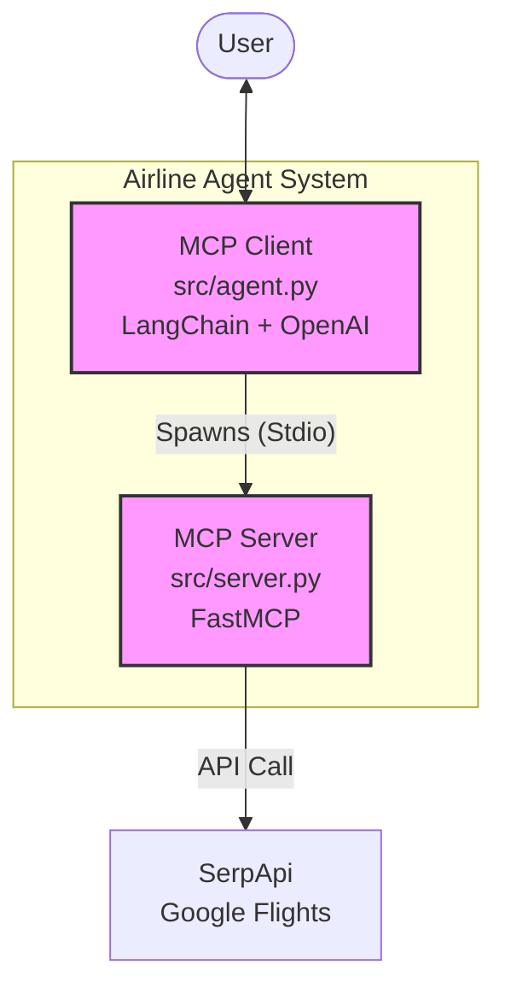

# Airline Booking Agent

An intelligent, conversational airline booking assistant built as a **Model Context Protocol (MCP)** Client-Server system. It uses **LangChain** for reasoning and **SerpApi (Google Flights)** for real-time flight data.

## Features
-   **Natural Language Search**: Ask for flights like "Find me a round trip from New York to London next week for 2 adults".
-   **Real-time Data**: Fetches live pricing, availability, and CO2 emissions via Google Flights (SerpApi).
-   **Smart Categorization**: Automatically categorizes passengers (Adults, Children, Infants) based on ages provided.
-   **Interactive Booking**: Collects passenger names and contact info, then simulates a booking transaction.
-   **MCP Architecture**: Decoupled Client-Server design. The Agent (Client) connects to a Flight Tools Server.

## Architecture
The system follows a strict **MCP Client-Server** pattern:



1.  **MCP Server (`src/server.py`)**:
    -   Exposes `search_flights` and `book_flight` tools via **FastMCP**.
    -   Handles API communication with SerpApi.
2.  **MCP Client (`src/agent.py`)**:
    -   Launches server as a subprocess.
    -   Dynamically discovers tools at runtime.
    -   Handles user interaction.

## Installation

1.  **Clone the repository**:
    ```bash
    git clone https://github.com/nmahendran-aws/flight-booking-assistant.git
    cd flight-booking-assistant
    ```

2.  **Install Dependencies**:
    ```bash
    python -m venv .venv
    source .venv/bin/activate
    pip install -r requirements.txt
    ```

3.  **Configure Environment**:
    Create a `.env` file with your API keys:
    ```bash
    OPENAI_API_KEY=sk-...
    SERPAPI_API_KEY=...  # Get from serpapi.com
    ```

## Usage

### Run the Agent (Client)
This launches the full interactive CLI experience.
```bash
python3 src/main.py
```
*Example Interaction:*
> **You**: Find me a flight from SFO to JFK on May 1st.
> **Agent**: One-way or Round Trip?
> **You**: Round trip, returning May 10th. 2 adults.
> **Agent**: [Searches and displays results...]
> **You**: Book the first one for Jane Doe and John Smith. Email is test@test.com.
> **Agent**: Booking Confirmed! Confirmation Code: X7Y9Z2.

### Run the Server (Standalone)
You can run the server directly if you want to connect it to other MCP clients (like Claude Desktop).
```bash
python3 src/server.py
```

## Changelog

### v0.4.1 - Enhanced Result Formatting (Current)
-   **Detailed Timestamps**: Search results now explicitly show Departure and Arrival dates/times.
-   **Airport Codes**: Added Origin/Destination airport codes to time details for clarity.

### v0.4.0 - Booking Logic
-   **Added Mock Booking**: `book_flight` tool simulates transaction.
-   **Enhanced Agent Flow**: Agent now handles data collection (Names, Email) before booking.
-   **Verification**: New test script `tests/verify_booking.py`.

### v0.3.0 - Enhanced Flight Search
-   **Added Round Trip Support**: `return_date` parameter supported.
-   **Added Passenger Details**: Support for `adults`, `children`, `infants` counts.
-   **Updated Agent Prompt**: Agent now strictly asks for trip type and passenger ages before searching.

### v0.2.0 - MCP Migration
-   **Architecture Refactor**: Converted monolithic script to MCP Client-Server.
-   **New Server**: Created `src/server.py` using `FastMCP`.
-   **New Client**: Refactored `src/agent.py` to use `mcp.client.stdio`.
-   **Removed Playwright**: Replaced fragile browser scraping with robust SerpApi tools.

### v0.1.0 - Initial Release
-   Basic Flight Search using Playwright (Browser Automation).
-   Simple CLI interface.
-   Basic LangChain Agent integration.
